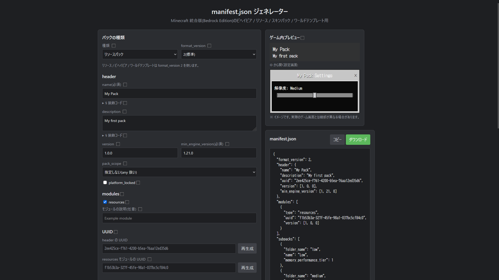

# manifest.json ジェネレーター

Minecraft 統合版(Bedrock Edition)のパック用 `manifest.json` を、ブラウザ上のフォームから作成できる静的Webツールです。
ビルド不要で、ブラウザで `index.html` を開くだけで動作します(JavaScript ライブラリへの依存はありません)。



## 特徴

- **4種類のパックに対応**: ビヘイビアパック / リソースパック / ワールドテンプレート / スキンパック
- **format_version 1 / 2 / 3 に対応**(v3 はプレビュー版。バージョンを semver 文字列で出力)
- **リアルタイムプレビュー**: 入力するたびに JSON が更新され、コピー・ダウンロードが可能
- **UUID の自動生成**: header と各モジュールの UUID を自動で作成し、個別に再生成可能
- **入力チェック**: バージョン形式・UUID 形式・必須項目などの問題を警告として表示
- **ⓘ ヘルプ**: 各項目のアイコンにホバーすると説明を表示
- **§ 装飾コード**: パック名・説明文に色や太字などの § コードをボタンで挿入でき、色付きでプレビュー(統合版のみの色にも対応)
- **ゲーム内プレビュー**: パック一覧と設定画面(サブパックの解像度スライダー、v3 の設定項目)を、ゲーム内のイメージで表示

### 対応している項目

| セクション | 内容 |
| --- | --- |
| header | name, description, version, min_engine_version, base_game_version, pack_scope, platform_locked, lock_template_options, allow_random_seed |
| modules | data, client_data, script(language / entry), resources, world_template, skin_pack, persona_piece |
| dependencies | パック(uuid)/ スクリプトモジュール(module_name) |
| capabilities | chemistry, editorExtension, experimental_custom_ui, script_eval, raytraced, pbr |
| subpacks | folder_name, name, memory_performance_tier(リソースパックのみ。配置先の表示、重複チェック、low / medium / high のプリセット追加) |
| metadata | authors, license, url, product_type, generated_with |
| settings (v3) | label, toggle, slider, dropdown, multiselect |

## 使い方

1. `index.html` をブラウザで開きます(サーバー不要)。
2. パックの種類と format_version を選び、各項目を入力します。
3. 右側の「ゲーム内プレビュー」と JSON プレビューを確認します。警告が出ている場合は内容を確認してください。
4. **コピー** または **ダウンロード** で `manifest.json` を取得し、パックのルートフォルダに置きます。

### § 装飾コードについて

パック名・説明文の入力欄の下にある「§ 装飾コード」を開くと、色(§0〜§f と統合版のみの色)と、太字 §l・斜体 §o・難読化 §k・リセット §r のボタンが使えます。
`manifest.json` には `§` がそのまま出力されます(UTF-8)。

## ファイル構成

```
index.html            画面
style.css             スタイル
app.js                manifest の生成・フォーム制御
formatting.js         § 装飾コードの定義とプレビュー描画
gamepreview.js        ゲーム内プレビューの描画
tips.js               ⓘ ヘルプの説明文
information_mark.svg  ヘルプアイコン
```

## 参考資料

- [Microsoft Learn: manifest.json for Behavior/Resource/Skin Packs and World Templates](https://learn.microsoft.com/minecraft/creator/reference/content/addonsreference/examples/addonmanifest)
- [Minecraft Wiki: Manifest.json](https://minecraft.wiki/w/Manifest.json)

## 注意事項

- format_version 3 はプレビュー版の仕様で、今後変更される可能性があります。
- `client_data` と `skin_pack` は公式ドキュメントの例などに基づいて追加しており、仕様の詳細は公式情報を確認してください。
- ゲーム内プレビューはあくまでイメージで、実際のゲーム画面とは細部が異なる場合があります。
- プレビューのピクセル風フォント(DotGothic16)は Google Fonts から読み込みます。オフライン時は標準フォントで表示されます。
- 本ツールは Mojang / Microsoft の公式ツールではなく、両社とは関係ありません。Minecraft は Mojang Studios / Microsoft の商標です。

## ライセンス

[MIT License](LICENSE)
